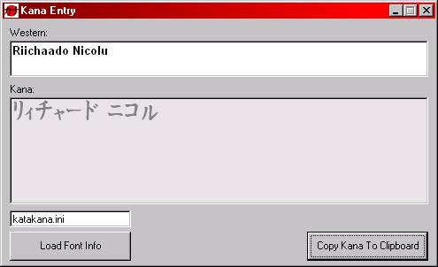



## New Japanese Kana Entry

### Description

This program converts syllables into Japanese Kana (Katakana/Hiragana) characters intelligently.

This program uses TTF fonts, so you don't need any extra language support to use it. Also, unlike the Japanese IME, the text can be copied into ANY program that supports TTF fonts including Paint Shop Pro etc.

There are two fonts included. Each has it's own font map .ini which tells the program where the right symbols are in the TTF font. This means you can make your own font maps for any font you have that includes Hiragana or Katakana symbols.

Such fonts are available on tons of free fonts websites. My "Japanese Katakana Entry" contained a fair few of them, and is still on PSC. Although this version is far more complete, but just as simple.

If you would like to contact me or would like more fonts with font maps give us a shout at zebracustard@hotmail.com

I hope this is some use to someone. ;-)
 
### More Info
 

             |
---                |---
**Submitted On**   |2000-08-30 16:55:40
**By**             |[Rik](https://github.com/Planet-Source-Code/PSCIndex/blob/master/ByAuthor/rik.md)
**Level**          |Intermediate
**User Rating**    |4.8 (19 globes from 4 users)
**Compatibility**  |VB 5\.0, VB 6\.0
**Category**       |[Complete Applications](https://github.com/Planet-Source-Code/PSCIndex/blob/master/ByCategory/complete-applications__1-27.md)
**World**          |[Visual Basic](https://github.com/Planet-Source-Code/PSCIndex/blob/master/ByWorld/visual-basic.md)
**Archive File**   |[CODE\_UPLOAD94308302000\.zip](https://github.com/Planet-Source-Code/rik-new-japanese-kana-entry__1-11102/archive/master.zip)

